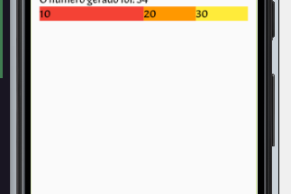
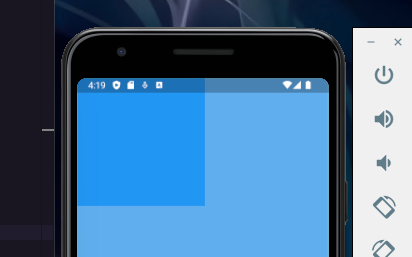
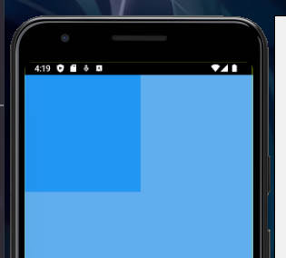

---
tags:
  - Flutter
  - Dart
---

### **Gerais**

`Column ()` - Alinha um componente embaixo do outro
`Row ()` - Alinha um componente ao lado do outro

**Alinhamento vertical**
```dart
mainAxisAlignment: MainAxisAlignment.center,
```

**Alinhamento horizontal**
```dart
Center(
     child: Text("Você clicou no botão $quantidadeDeCliques vezes",
          style: GoogleFonts.acme(fontSize: 20)),
),
```
**Alinhamento horizontal também**
```dart
crossAxisAlignment: CrossAxisAlignment.start,
```


### **Margin e Padding**

**Opção 1:** Você pode setar dessa forma os 4 tamanhos: 
```dart
body: Container(
        margin: const EdgeInsets.fromLTRB(10, 10, 10, 10),
        child: Column(
          crossAxisAlignment: CrossAxisAlignment.start,
          children: [
            Text("Você clicou no botão $quantidadeDeCliques vezes",
                style: GoogleFonts.acme(fontSize: 20)),
            Text("O número gerado foi: $numeroGerado",
                style: GoogleFonts.acme(fontSize: 20)),
          ],
       ),
    ),
```

**Opção 2:** Você pode setar um tamanho horizontal e vertical: 
```dart
margin: const EdgeInsets.symmetric(horizontal: 16, vertical: 16),
```


### **Width**
- O `width` tem outras propriedades, mas para abranger a tela inteira temos:
```dart
body: Container(
  color: Colors.amber,
  width: double.infinity,
),
```


### **Expanded**

O código:
```dart
children: [
   Expanded(
     flex: 2,
     child: Container(
     color: Colors.red,
     child: Text("10", style: GoogleFonts.acme(fontSize: 20))),
   ),
   Expanded(
     child: Container(
     color: Colors.orange,
     child: Text("20", style: GoogleFonts.acme(fontSize: 20))),
   ),
   Expanded(
     child: Container(
     color: Colors.yellow,
     child: Text("30", style: GoogleFonts.acme(fontSize: 20))),
   ),
],

```
O Expanded vai ocupar o maior espaço que ele puder em uma linha neste caso, o código acima divide a linha em 4 espaços onde o primeiro expanded ocupa 2 deles sendo isso designado pela propriedade `flex`

Ficando da seguinte forma: 




### **SizedBox**

Usamos `SizedBox` quando queremos setar um tamanho específico e fixos para um container

```dart
SizedBox(
	width: 200,
	height: 100, 
	child: Container(
		color: Colors.green,
		child: Text("Ações do usuário",
			 style: GoogleFonts.acme(fontSize: 20)
		)
	),
),
```

O `SizedBox` pouco é utilizado pois no `Container` já contém as propriedades `width` e `heigth`, entre outras propriedades e portanto torna-se preferível.

### SafeArea

Usa-se `SafeArea` para que o componente não fique por cima da área de notificações:

```dart

return SafeArea(
      child: Scaffold(
        backgroundColor: const Color.fromARGB(255, 97, 174, 238),
        body: Column(
          children: [
            Container(
              width: 200,
              height: 200,
              color: Colors.blue,
            )
          ],
        ),
      ),
);
```

Antes: 



Depois:



